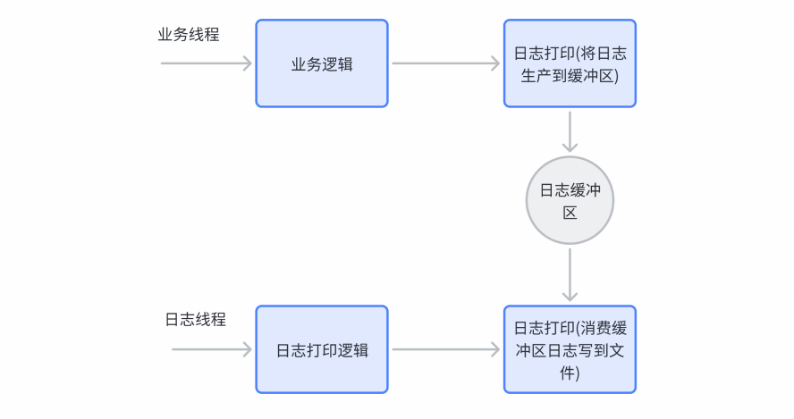

# LogSystem  C++ - 基于多设计模式下的同步&异步⽇志系统

日志系统:  
- 日志:程序运行过程中所记录的程序运行状态信息  
- 作用:记录了程序运行状态信息,以便于程序员能够随时根据状态信息,对系统的运行状态进行分析  
- 例子:平常调试时打印的这些信息就是日志  
- 功能:能够让用户非常简便的进行日志的输出,以及控制　

### 1.项目介绍:
本项目主要支持以下功能:
- 支持多级别日志消息  
    > 不同级别的日志应对着不同的场景,能够通过日志等级来限制输出.  
    > 当程序在调试阶段,大于调试级别的日志都可以输出.当程序发布时,将限制级别设置为错误,则低于错误级别的日志不会再输出.
- 支持同步日志和异步日志
    > 同步表示一个工作由自己来干(主线程),异步表示一个工作由别人来干(多线程)  
    > 同步是指和日志系统和主程序使用同一个线程;  
    > 异步是指日志系统独立于业务使用一个独立的线程.  
    > 异步日志的好处是:当出现诸如数据库写入失败或磁盘满等问题时,同步日志会阻塞,影响业务运行;而异步日志只会阻塞日志输出,不会影响业务运行.
- 支持可靠写入日志到控制台、文件以及滚动文件中
    > 滚动文件（可以切换不同文件输入日志）  
    > 还可以定期删除
- 支持扩展不同的日志落地目标地
    > 能够输出到数据库，服务器等. 具有高扩展性
- 支持多线程程序并发写日志
    > 该日志系统是线程安全的多线程日志系统,多个日志线程对同一个文件写入是安全的

### 2.开发环境
- CentOS 7
- vscode/vim
- g++/gdb
- Makefile

### 3.核心技术
- 类层次设计(主要以继承和多态的应用)  
    > 类的模块化设计的一种思想
- C++11(多线程、auto、智能指针、右值引用等)
- 双缓冲区  
- 生产消费模型  
- 多线程  
- 设计模式(单例、工厂、代理、建造者等)  

### 4.环境搭建
本项目不依赖其他第三方库，只需要安装好CentOS/Ubuntu + vscode/vim环境即可开发

### 5.日志系统介绍
#### 5.1 为什么需要日志系统
- 生产环境的产品为了保证其稳定性和安全性是不允许开发人员附加调试器去排查问题，这种情况可以借助日志系统打印一些日志来帮助开发人员解决问题  
- 已上线的产品客户端出现bug无法复现,复现耗时太长等问题,也就是场景复现困难的情况下,如果能够在当时出问题的时候能够记录详细的信息的话,那排除的时候就方便很多.因此可以借助日志系统打印日志并上传到服务端帮助开发人员进行分析
- 一些高频操作在少量调试次数下可能无法触发我们想要的行为,如通过断点的暂停方式,我们不得不重复操作几十次,上百次甚至更多,导致排查问题效率非常低下,可以借助打印日志的方式排查问题
- 在分布式、多线程、多进程代码中，出现bug比较难以定位，可以借助日志系统打印log帮助定位bug，分析是哪台主机、哪个线程、哪个进程出现的问题,能够更加具象
- 帮助首次接触项目代码的新开发人员理解代码的运行流程。日志系统记录了项目的运行过程，能够记录程序第一步，第二步干了什么等等，能够对项目运行的流程有个基础的了解,让接下来阅读代码时会更加轻松

#### 5.2 日志系统技术实现
- 利用printf、std::cout等输出函数将日志信息打印到控制台
    > 学习阶段常使用的一种方式
- 对于大型商业化项目，为了方便排查问题，我们一般会将日志输出到文件或者数据库系统方便查询和分析日志，主要分为同步日志和异步日志方式
    
##### 5.2.1 同步写日志
同步日志是指当输出日志时，必须等待日志输出语句执行完毕后，才能执行后面的业务逻辑语句，日志输出语句与程序的业务逻辑语句将在同一个线程运行。
每次调用一次打印日志API就对应一次系统调用write写日志文件。  
  
好处是设计思想简单,流程简单。缺点是在高并发场景下，随着日志数量不断增加，同步日志系统容易产生系统瓶颈。  
1.一方面，大量的日志打印需要等量的write系统调用，有一定系统开销  
2.另一方面， 打印日志的进程附带了大量同步的磁盘IO，影响程序性能  
3.如果在向服务器发送日志的网络IO过程中遇到网络拥塞,则程序会阻塞住，影响业务正常运行

##### 5.2.2 异步写日志
异步日志是指在进行日志输出时，日志输出语句与业务逻辑语句并不是在同一个线程中运行，而是有专门的线程用于进行日志输出操作。业务线程只需要将日志放到一个内存缓冲区中，不用等待即可继续执行后续业务逻辑（作为日志的生产者），而日志的落地操作交给单独的日志线程去完成（作为日志的消费者），这是一个典型的生产-消费模型。  
  
这样做的好处是即使日志没有真正的完成输出也不会影响程序的主业务，对业务运行的影响最小, 提高程序的性能:
- 主线程调用日志打印接口成为非阻塞操作
- 同步的磁盘IO从主线程中剥离出来交给单独的线程完成
